# learnerReportCS

## Steps to Create Git Repositories and Deploy on Kubernetes

1. **Create Git Repositories**:
   - Create two Git repositories, one for the frontend and one for the backend:
     - [Frontend Repository](https://github.com/UnpredictablePrashant/learnerReportCS_frontend)
     - [Backend Repository](https://github.com/UnpredictablePrashant/learnerReportCS_backend)
   - We use this repo in Our Project
     - [learnerReportCS] (https://github.com/surendergupta/learnerReportCS.git)

2. **Directory Structure**:
   - Inside your local directory, create folders named `frontend` and `backend`.
   - Inside each directory (`frontend` and `backend`), create a folder named `k8s`.

3. **Create Kubernetes Manifests**:
   - In the `k8s` folder of both frontend and backend repositories, create `deployment.yml` and `service.yml` files.
   - Backend deployment.yml
```
apiVersion: apps/v1
kind: Deployment
metadata:
  name: backend-deployment
spec:
  replicas: 2
  selector:
    matchLabels:
      app: learner-report-backend
  template:
    metadata:
      labels:
        app: learner-report-backend
    spec:
      containers:
      - name: learner-report-backend
        image: surendergupta/learnercs_be
        resources:
          limits:
            memory: "128Mi"
            cpu: "500m"
        ports:
        - containerPort: 5000

```
   
   - Backend service.yml

```
apiVersion: v1
kind: Service
metadata:
  name: backend-service
spec:
  type: LoadBalancer
  selector:
    app: learner-report-backend
  ports:
  - port: 80
    targetPort: 5000

```
   - Frontend deployment.yml

```
apiVersion: apps/v1
kind: Deployment
metadata:
  name: frontend-deployment
spec:
  replicas: 1
  selector:
    matchLabels:
      app: learner-report-frontend
  template:
    metadata:
      labels:
        app: learner-report-frontend
    spec:
      containers:
      - name: learner-report-frontend
        image: surendergupta/learnercs_fe
        resources:
          requests:
            memory: "512Mi"   # Increase memory request
          limits:
            memory: "512Mi"   # Increase memory limit        
            cpu: "1000m"
        ports:
        - containerPort: 3000

```

   - Frontend service.yml

```
apiVersion: v1
kind: Service
metadata:
  name: frontend-service
spec:
  type: LoadBalancer
  selector:
    app: learner-report-frontend
  ports:
  - port: 80
    targetPort: 3000

```

4. **Deploy on Minikube**:
   - Install Minikube locally.
   - Deploy both frontend and backend services using their respective `deployment.yml` and `service.yml` files inside the `k8s` folders.

5. **Install Helm**:
   - Install Helm using Chocolatey (choco).
   - Create a folder named `container-orchestration-chart` for Helm charts.

6. **Create Helm Charts**:
   - Create Helm charts container-orchestration-chart.

7. **Update Values**:
   - Update the `values.yml` file for both frontend and backend Helm charts with appropriate configurations.

8. **Package and Run Charts**:
   - Package both Helm charts.
   - Install Helm charts.   

```
helm create container-orchestration-chart
helm package container-orchestration-chart
helm template container-orchestration-chart  > manifests.yaml
helm install container-orchestration-chart container-orchestration-chart

helm uninstall container-orchestration-chart
```

   - Backend Deployment Using Helm On Minikube Locally

```
kubectl get svc
kubectl port-forward service/container-orchestration-chart-learnercs-be-svc 5000:3001
```


   - Frontend Deployment Using Helm On Minikube Locally

```
kubectl get svc
kubectl port-forward service/container-orchestration-chart-learnercs-fe-svc 3002:3000
```


9. **Jenkins Pipeline**:
   - Set up a Jenkins pipeline on your localhost.
   - Configure the pipeline to build, test, and deploy the frontend and backend services.
   - Jenkins for minikube cluster deployment
```
pipeline {
    agent any
    
    parameters {
        choice(name: 'action', choices: 'create\ndelete', description: 'Select create or destroy.')
    }
    
    environment {
        
        DOCKER_HUB_KEY = credentials('dockerhubcredentials')
        DOCKER_IMAGE_FRONTEND = 'surendergupta/learnercs_fe'
        DOCKER_IMAGE_BACKEND = 'surendergupta/learnercs_be'
        DOCKER_TAG = "latest"
        
        GITHUB_URL = 'https://github.com/surendergupta/learnerReportCS.git'
        GIT_BRANCH = 'main'
        
        KUBECONFIG = credentials('kubeconfig')
        KUBE_NAMESPACE = 'default'
        
        HELM_CHART_PATH = './container-orchestration-chart'
        HELM_RELEASE_NAME = 'container-orchestration-chart'
    }
    
    stages {
        stage('Clean Workspace'){
            when { expression { params.action == 'create'}}
            steps{
                cleanWs()
            }
        }
        stage('Checkout From Git'){
            when { expression { params.action == 'create'}}
            steps{
                git branch: env.GIT_BRANCH, url: env.GITHUB_URL
            }
        }
        stage('Build Docker Image') {
            parallel {
                stage('build backend') {
                    when { expression { params.action == 'create'}}
                    steps {
                        script {
                            docker.withRegistry('https://index.docker.io/v1/', 'dockerhubcredentials') {
                                def customImage = docker.build("${env.DOCKER_IMAGE_BACKEND}:${env.DOCKER_TAG}", "./backends") 
                                customImage.push()
                            }
                        }
                    }
                }
                stage('build frontend') {
                    when { expression { params.action == 'create'}}
                    steps {
                        script {
                            docker.withRegistry('https://index.docker.io/v1/', 'dockerhubcredentials') {
                                def customImage = docker.build("${env.DOCKER_IMAGE_FRONTEND}:${env.DOCKER_TAG}", "./frontends")
                                customImage.push()
                            }
                        }
                    }
                }
            }
        }
        stage('Deploy to Minikube using HELM Kubernetes') {
            when { expression { params.action == 'create'}}
            steps {
                script {
                    withCredentials([file(credentialsId: 'kubeconfig', variable: 'KUBECONFIG')]) {                        
                        bat "helm package ${env.HELM_RELEASE_NAME}"
                        bat "helm template ${env.HELM_RELEASE_NAME}  > manifests.yaml"
                        bat "helm install ${env.HELM_RELEASE_NAME} ${env.HELM_CHART_PATH}"
                    }
                }
            }
        }
        stage ('Delete previous Helm Chart') {
            when { expression { params.action == 'delete'}}
            steps {
                script {
                    withCredentials([file(credentialsId: 'kubeconfig', variable: 'KUBECONFIG')]) {
                        def releaseExists = bat(script: "helm list -q | grep -x ${env.HELM_RELEASE_NAME}", returnStatus: true) == 0
                        if (releaseExists) {
                            bat "helm uninstall ${env.HELM_RELEASE_NAME}"
                        } else {
                            echo "Release ${env.HELM_RELEASE_NAME} not found, skipping uninstallation."
                        }
                    }
                }
            }
        }        
    }
}

```


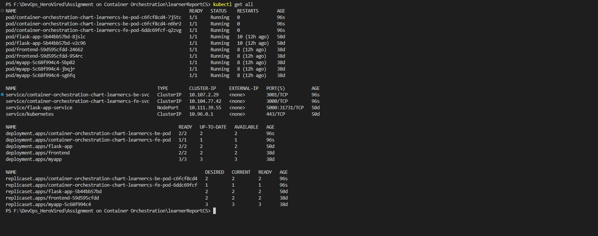


```
kubectl port-forward service/container-orchestration-chart-learnercs-be-svc 5000:3001
kubectl port-forward service/container-orchestration-chart-learnercs-fe-svc 3002:3000

```

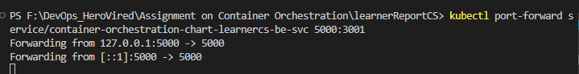

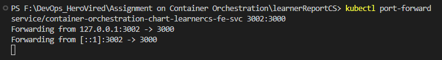

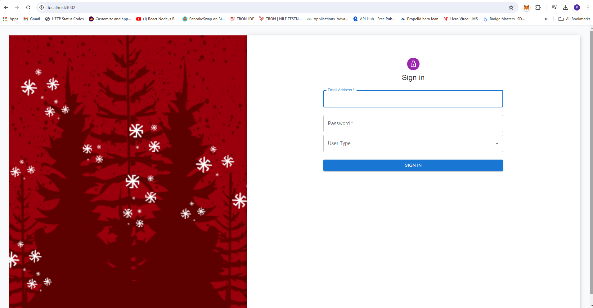

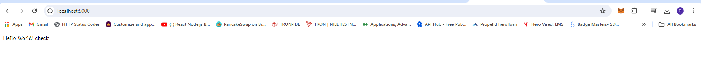

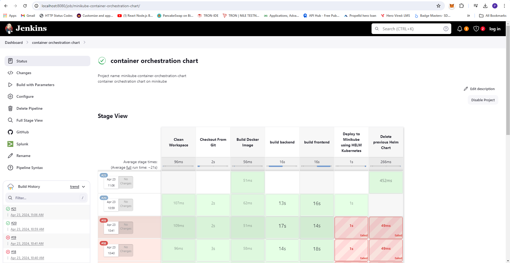

10. **Deployment on AWS EKS**:
    - Use EKSCTL to create an AWS EKS cluster.
    - Deploy the Helm charts on the AWS EKS cluster using the Jenkins pipeline.
    - Jenkins for EKS cluster deployment

```
pipeline {
    agent any
    
    parameters {
        choice(name: 'action', choices: 'create\ndelete', description: 'Select create or destroy.')
    }
    
    environment {
        
        DOCKER_HUB_KEY = credentials('dockerhubcredentials')
        DOCKER_IMAGE_FRONTEND = 'surendergupta/learnercs_fe'
        DOCKER_IMAGE_BACKEND = 'surendergupta/learnercs_be'
        DOCKER_TAG = "latest"
        
        GITHUB_URL = 'https://github.com/surendergupta/learnerReportCS.git'
        GIT_BRANCH = 'main'
        
        HELM_CHART_PATH = './container-orchestration-chart'
        HELM_RELEASE_NAME = 'container-orchestration-chart'

        AWS_REGION = 'us-west-2'
        AWS_EKS_CLUSTER_NAME = 'container-orchestration-cluster'
    }
    
    stages {
        stage('Clean Workspace'){
            when { expression { params.action == 'create'}}
            steps{
                cleanWs()
            }
        }
        stage('Checkout From Git'){
            when { expression { params.action == 'create'}}
            steps{
                git branch: env.GIT_BRANCH, url: env.GITHUB_URL
            }
        }
        stage('Build Docker Image') {
            parallel {
                stage('build backend') {
                    when { expression { params.action == 'create'}}
                    steps {
                        script {
                            docker.withRegistry('https://index.docker.io/v1/', 'dockerhubcredentials') {
                                def customImage = docker.build("${env.DOCKER_IMAGE_BACKEND}:${env.DOCKER_TAG}", "./backends") 
                                customImage.push()
                            }
                        }
                    }
                }
                stage('build frontend') {
                    when { expression { params.action == 'create'}}
                    steps {
                        script {
                            docker.withRegistry('https://index.docker.io/v1/', 'dockerhubcredentials') {
                                def customImage = docker.build("${env.DOCKER_IMAGE_FRONTEND}:${env.DOCKER_TAG}", "./frontends")
                                customImage.push()
                            }
                        }
                    }
                }
            }
        }
        stage('Connect to EKS') {
            when {
                expression { params.action == 'create' }
            }
            steps {
                script {
                    withCredentials([aws(credentialsId: 'aws-config', region: env.AWS_REGION)]) {
                        def eksClusterExists = bat(script: "aws eks describe-cluster --name ${env.AWS_EKS_CLUSTER_NAME} --region ${env.AWS_REGION}", returnStatus: true) == 0
                        if (!eksClusterExists) {
                            bat """
                            eksctl create cluster --name ${env.AWS_EKS_CLUSTER_NAME} --region ${env.AWS_REGION} --nodegroup-name standard-workers --node-type t2.medium --nodes 3 --nodes-min 3 --nodes-max 5
                            """
                        }
                    }
                }
            }
        }
        stage ('deploy to EKS using HELM Kubernetes') {
            when { expression { params.action == 'create'}}
            steps {
                script {
                    withCredentials([aws(credentialsId: 'aws-config', region: env.AWS_REGION )]) {
                        bat "aws eks --region ${env.AWS_REGION} update-kubeconfig --name ${env.AWS_EKS_CLUSTER_NAME}"
                        bat "helm install ${env.HELM_RELEASE_NAME} ${env.HELM_CHART_PATH}"
                    }
                }
            }
        }
        stage ('Delete previous Helm Chart') {
            when { expression { params.action == 'delete'}}
            steps {
                script {
                    withCredentials([aws(credentialsId: 'aws-config', region: env.AWS_REGION )]) {
                        bat "helm uninstall ${env.HELM_RELEASE_NAME}"
                    }
                }
            }
        }        
    }
}
```

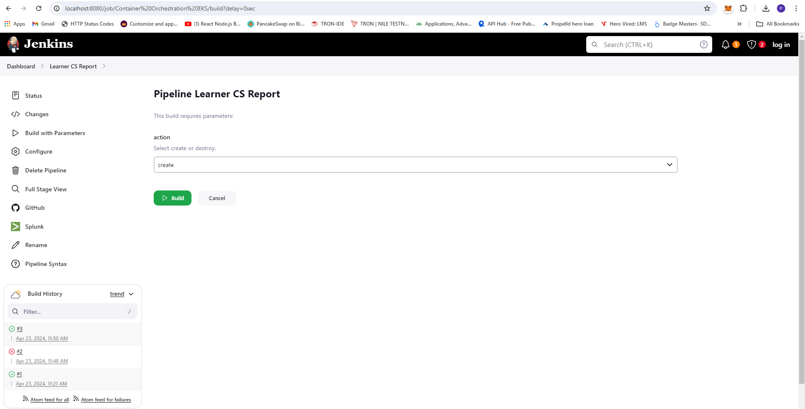

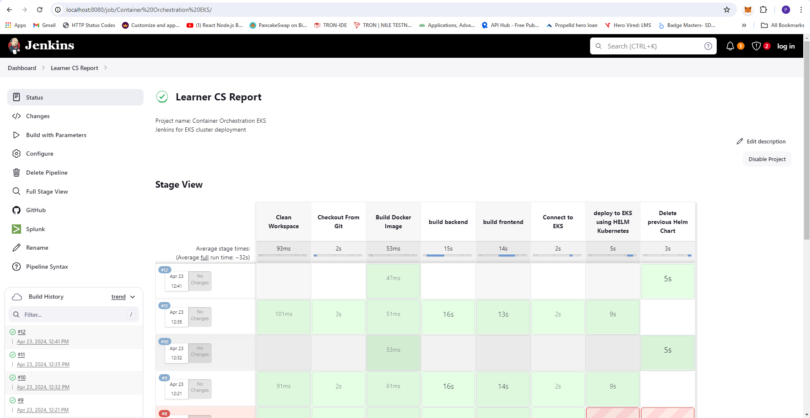


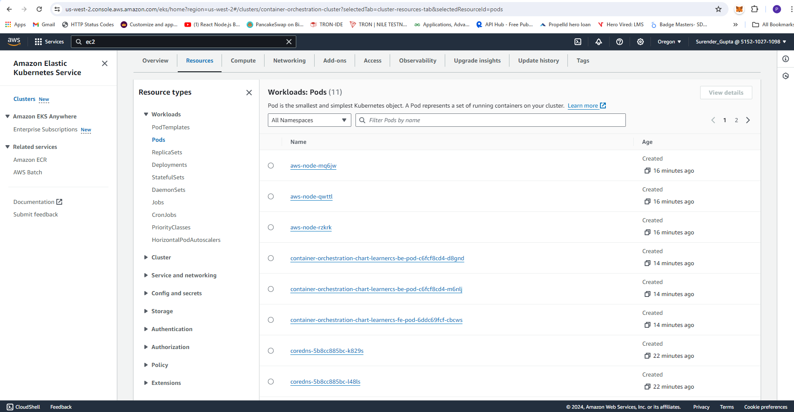

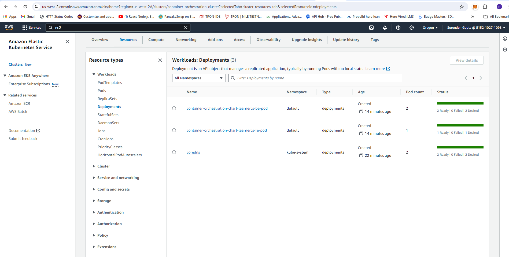

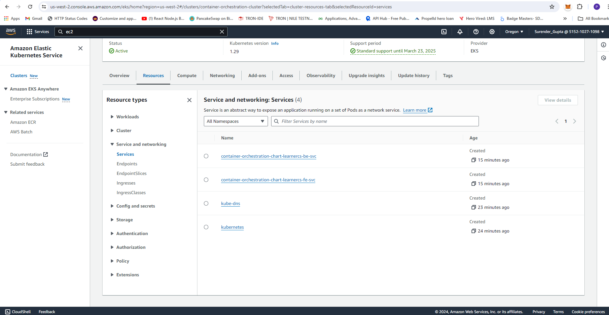

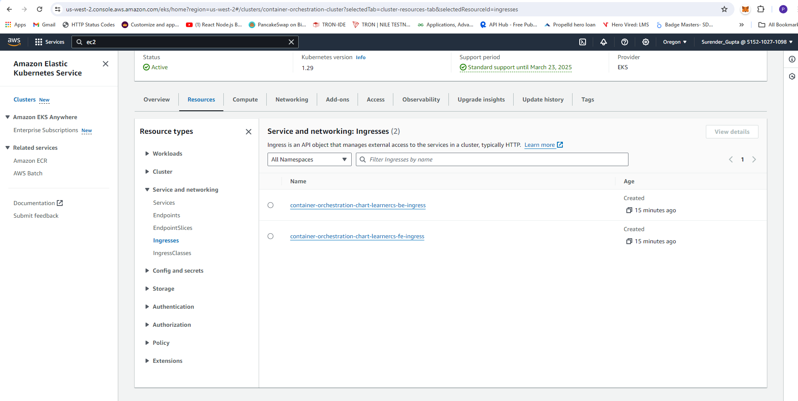

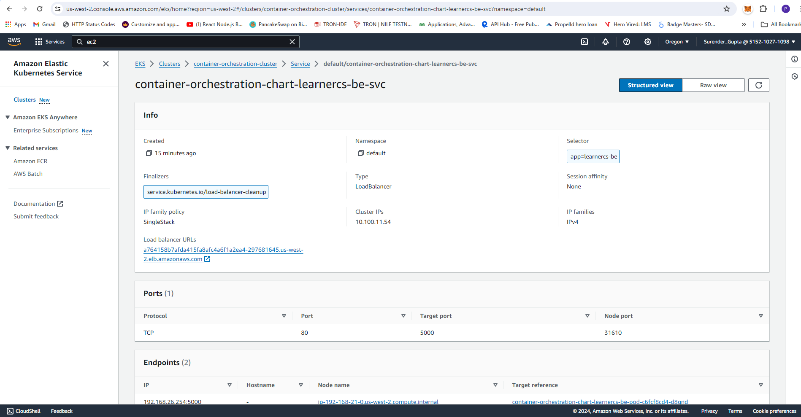

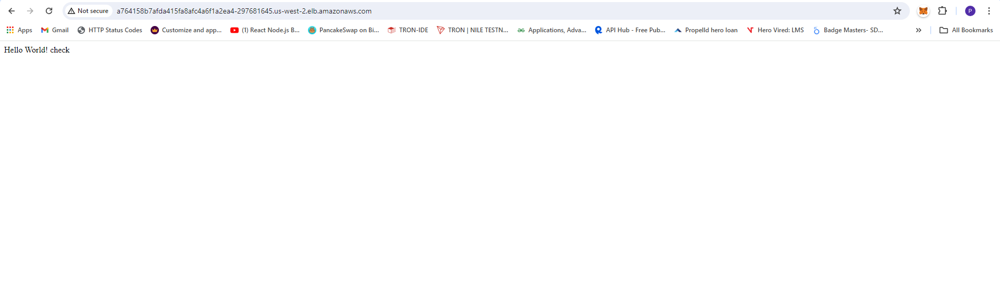

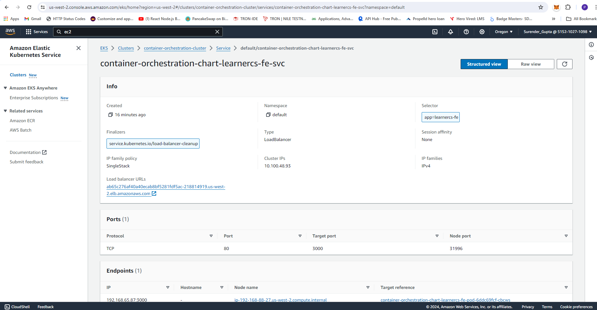

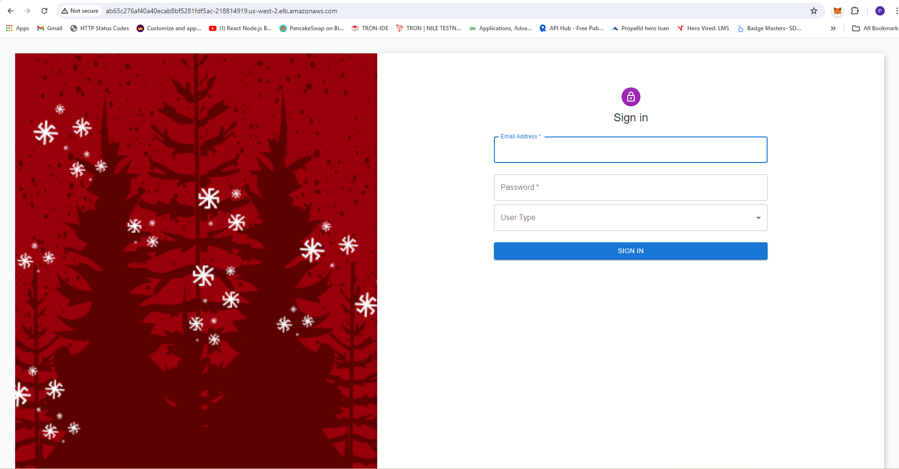

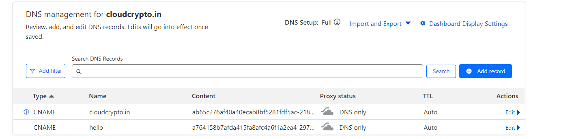

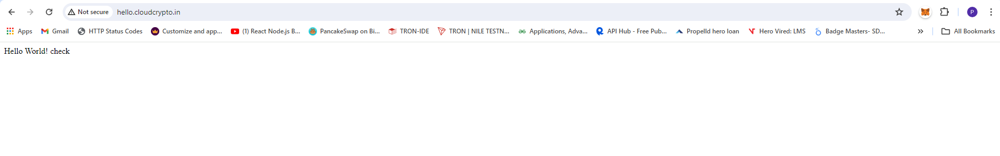

By following these steps, you can effectively manage your frontend and backend services, deploy them on Kubernetes locally using Minikube, and automate the deployment process using Jenkins pipelines, including deployment on AWS EKS.
